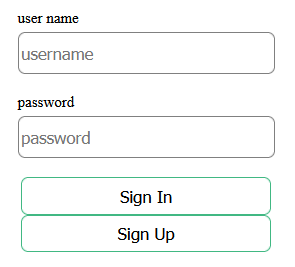
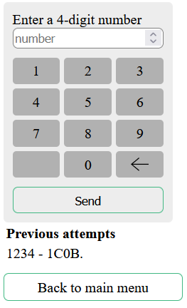

# Bulls and Cows game
Простая игра быки и коровы, реализованная как веб-приложение.
## Как пользоваться
Пользователю необходимо зарегистрироваться в системе и авторизоваться для начала игры.

Затем можно начать новую игру.

Смысл игры отгадать 4-х значное число, загаданное компьютером. Число состоит только из уникальных цифр.
Пользователь вводит своё число и получает ответ от сервера - сколько цифр в его числе совпадают с загаданным 
и сколько цифр стоят на своих местах. Ответ приходит в формате xCyB, где x - это число коров, то есть цифр, 
которые просто есть в загаданном числе, а y - число цифр, которые есть в загаданном числе и стоят на своих местах.

Также в приложении реализована возможность продолжить незавершенную игру и 
посмотреть рекорды всех пользователей (топ по среднему числу попыток 
до угадывания числа).

## Технологии, применяемые в проекте
* Java 11;
* Spring;
* Hibernate;
* Spring Security;
* HTML, CSS;
* Docker.

## Запуск проекта
Реализован запуск приложения в docker-контейнерe со встроенной СУБД H2.
1 вариант:
* Собрать jar проекта: mvn -clean -install;
* Создать docker образ из директории проекта командой docker build -t <имя образа> .  ;
* Запустить приложение командой docker run --name <имя контейнера> -p 8080:8080 <имя образа>
2 вариант:
* Склонировать образ с Docker Hub - https://hub.docker.com/repository/docker/grigoriypopov/bullsandcows
* Запустить приложение командой docker run --name <имя контейнера> -p 8080:8080 bullsandcows:v1
